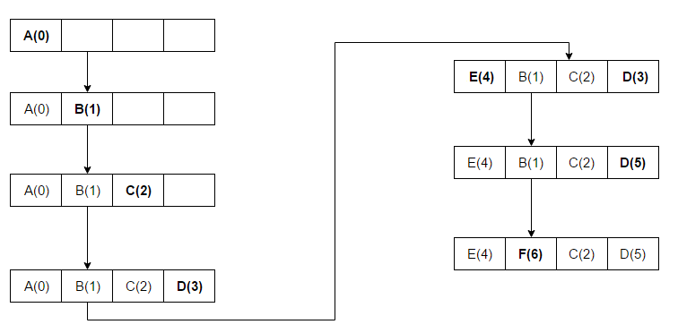

golang-lru
==========
**Note**:  LRU is the short for Least recently used.

Discards the least recently used items first. This algorithm requires keeping track of what was used when, which is expensive if one wants to make sure the algorithm always discards the least recently used item. General implementations of this technique require keeping "age bits" for cache-lines and track the "Least Recently Used" cache-line based on age-bits. In such an implementation, every time a cache-line is used, the age of all other cache-lines changes. LRU is actually [a family of caching algorithms](https://en.wikipedia.org/wiki/Page_replacement_algorithm#Variants_on_LRU) with members including 2Q by Theodore Johnson and [Dennis Shasha](http://www.vldb.org/conf/1994/P439.PDF), and LRU/K by Pat O'Neil, Betty O'Neil and [Gerhard Weikum](http://doi.acm.org/10.1145/170035.170081).


**Thanks for**:[Advaitjavadekar's Pictrue.](https://en.wikipedia.org/wiki/File:Lruexample.png)

The access sequence for the below example is A B C D E D F.


In the above example once A B C D gets installed in the blocks with sequence numbers (Increment 1 for each new Access) and when E is accessed, it is a miss and it needs to be installed in one of the blocks. According to the LRU Algorithm, since A has the lowest Rank(A(0)), E will replace A.

https://en.wikipedia.org/wiki/File:Lruexample.png

* The `lru` package which implements a fixed-size.
* Thread safe LRU cache. 
* Based on the cache in google [Groupcache lru](https://github.com/golang/groupcache/tree/master/lru).
* Simple switching between LRU,Cache,TwoQueueCache and ARCCache.

# Example

Usage for LRU:

```go
package main

import (
	"fmt"

	"github.com/flyaways/golang-lru"
	"github.com/flyaways/golang-lru/simplelru"
)

var (
	cache simplelru.LRUCache
	err   error
)

func main() {
	cache, err = lru.New(8)
	/*
		cache, err = simplelru.NewLRU(8, func(key interface{}, value interface{}) {
			fmt.Println(time.Now().Format(time.RFC3339Nano))
		})
		cache, err = lru.NewWithEvict(8, func(key interface{}, value interface{}) {
			fmt.Println(time.Now().Format(time.RFC3339Nano))
		})
		cache, err = lru.New2Q(8)
		cache, err = lru.New2QParams(8, 0.5, 0.5)
		cache, err = lru.NewARC(8)
	*/

	if err != nil {
		panic(err)
	}

	for i := 0; i < 16; i++ {
		fmt.Println(i, cache.Add(i, nil))
	}

	fmt.Println(cache.Get(6))
	fmt.Println(cache.Contains(6))
	fmt.Println(cache.Peek(6))
	fmt.Println(cache.GetOldest())
	cache.Remove(6)
	fmt.Println(cache.RemoveOldest())
	fmt.Println(cache.Keys())
	fmt.Println(cache.Len())
	cache.Purge()
	fmt.Println(cache.Len())
}

```

More examples can be found at [github.com/flyaways/golang-lru/_examples](https://github.com/flyaways/golang-lru/_examples).


# Reference

* [https://github.com/hashicorp/golang-lru](https://github.com/hashicorp/golang-lru)
* [https://github.com/golang/groupcache/lru](https://github.com/golang/groupcache/tree/master/lru)

# Copyright and License
Copyright 2018 The golang-lru Authors. All rights reserved.

for the golang-lru Authors. Code is released under
[the Apache 2 license](https://github.com/flyaways/golang-lru/blob/master/LICENSE).

[](https://app.fossa.io/projects/git%2Bhttps%3A%2F%2Fgithub.com%2Fflyaways%2Fgolang-lru?ref=badge_large)

